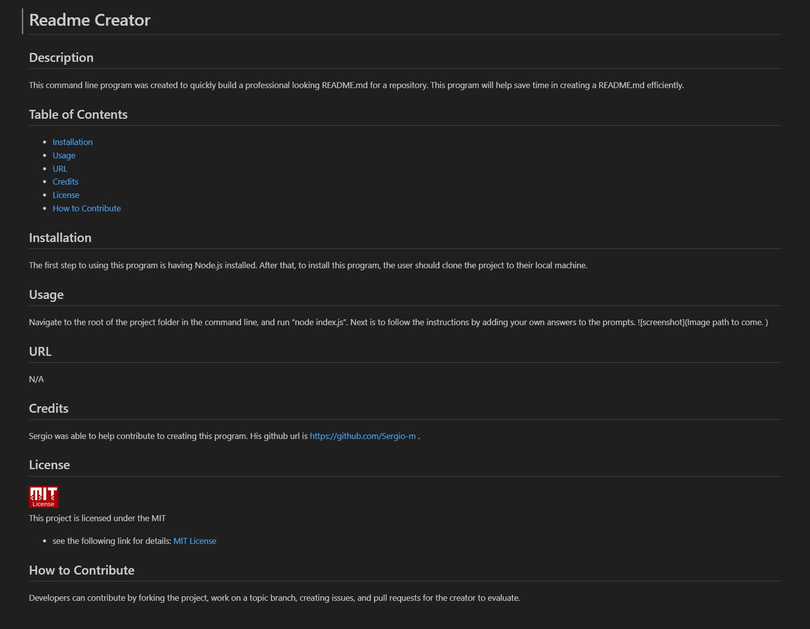

# Readme Creator

## Description 
This command line program was created to quickly build a professional looking README.md for a repository.  This program will help save time in creating a README.md efficiently.

## Table of Contents
- [Installation](#installation)
- [Usage](#usage)
- [URL](#url)
- [Credits](#credits)
- [License](#license)
- [How to Contribute](#how-to-contribute)
- [Questions](#questions)

## Installation
The first step to using this program is having Node.js installed.  After that, to install this program, the user should clone the project to their local machine.

## Usage
Navigate to the root of the project folder in the command line, and run “node index.js”.  Next is to follow the instructions by adding your own answers to the prompts. 

## URL
n/a

## Credits
Sergio was able to help contribute to creating this program.  His github url is https://github.com/Sergio-m .  

## License

This project is licensed under the MIT 
- see the following link for details: [MIT License](https://opensource.org/licenses/MIT)

## How to Contribute
Developers can contribute by forking the project, work on a topic branch, creating issues, and pull requests for the creator to evaluate.  

## Questions
My github profile is: https://github.com/Taboada-B

My email is: b.taboada123@gmail.com
